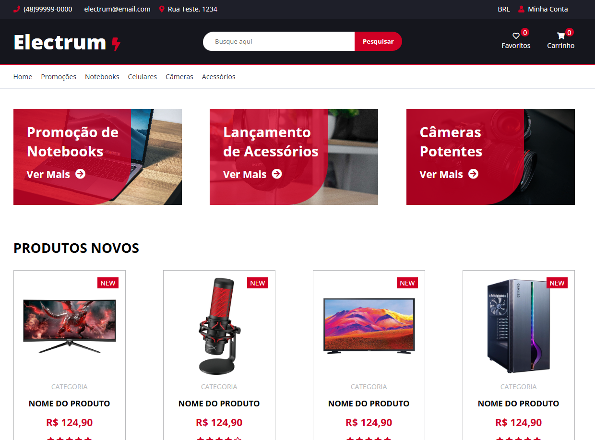

# Electrum - Landing Page de E-commerce 🛒

  
*Uma landing page para e-commerce, desenvolvida com HTML, CSS e SASS.*

## 🌟 Visão Geral

**Electrum** é uma landing page de e-commerce projetada para destacar produtos e oferecer uma experiência visual moderna e atraente. Este projeto foi desenvolvido com foco em boas práticas de desenvolvimento front-end e organização de estilos com **SASS**, permitindo fácil escalabilidade e manutenção.

### 🌐 Acesse o Projeto:
👉 [Visualizar Electrum](https://beatriztota.github.io/Electrum-page/)

---

## 🛠️ Tecnologias Utilizadas

- **HTML5**  
- **CSS3**  
- **SASS/SCSS**  

## 💡 Funcionalidades
Design responsivo e otimizado para dispositivos móveis.
Estrutura modular com componentes reutilizáveis em SASS.
Estilização moderna com o uso de variáveis, mixins e estruturação SCSS.

## 🚀 Como Usar
Clone o repositório:

       git clone https://github.com/beatriztota/Electrum-page.git
       cd Electrum-page
Abra o arquivo index.html no navegador para visualizar a página.

    
       npm install -g sass
       sass styles/main.scss styles/main.css
